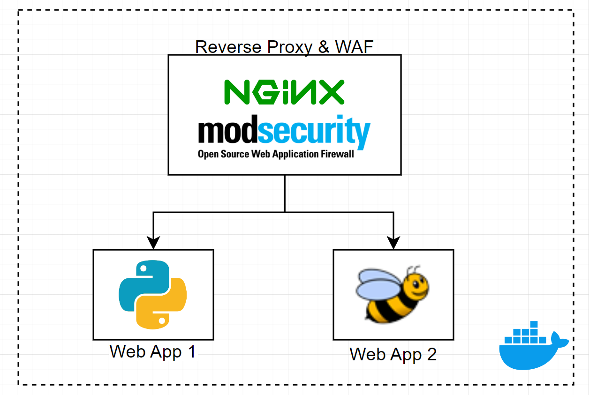

# TPE - Redes de Información - WAF


## Descripción
El propósito de este TP es exponer la tecnología de Web App Firewall (WAF), sus beneficios y funcionamiento a grandes rasgos. Es TP se basa en la herramienta ModSecurity, la cual permite muy fácilmente implementar un WAF, en conjunto con un proxy reverso.


## Enunciado de TP
- No puede ser implementado en nube.
- Configurar un servidor Proxy que funcione como proxy reverso para recibir las peticiones para al menos 2 servidores con web server.
- Configurar un servidor con ModSecurity que reciba las redirecciones del Proxy y chequee la seguridad de las mismas
- Configurar al menos 3 reglas de solo detección para realizar análisis.
- Configurar al menos 3 reglas de bloqueo.
- Probar al menos 3 ataques para mostrar la respuesta del waf, configurar un página default de respuesta ante detección de anomalía.


## Instalación

### Requisitos:
- Docker
- Python 3 

### Pasos de instalación:
1. En la carpeta raiz del TP, ejecutar: 
```bash
docker compose up
```
2. Una vez levantados los contenedores, las web apps se puede acceder desde:
- bWebApp: [http://localhost/bwapp/install.php](http://localhost/bwapp/)
- rWebApp: [http://localhost/rwebapp/](http://localhost/rwebapp/)

### Setup de bWebApp:
1. Primero se debe visitar la siguiente pagina [http://localhost/bwapp/install.php](http://localhost/bwapp/install.php). Ahi debe clickear en el link, cuando dice: *"Click here to install bWebApp"*
2. Una vez instalado, debe apretar en el tab: *New User*, en donde completar los campos provistos.
3. Apretar en *Login* e ingresar la información que uso anteriormente. Importante: seleccionar "low" cuando pide: "Set the security level".
4. Una vez autenticado, se encontrara en el tab *Bugs*, en el cual puede seleccionar que tipo de ataque quiere probar (ej: SQL inection (GET/Search)).

### Testeo de DoS:
1. Tener instalado el modulo *requests*: 
```bash
pip install requests
```
2. En la carpeta raiz del TP, ejecutar:
```bash
python3 ./testing/test-dos.py <CANTIDAD_DE_REQUESTS_EN_PARALLELO>
```


## Implementación

### Arquitectura:
A continuación, se muestra la arquitectura usada para cumplir con los requisitos:



### Componentes:
Todos los siguientes componentes corren en containers Docker. Estos son: 
1. **Reverse Proxy:** Se tiene un servidor nginx, el cual se le agrega el módulo de ModSecurity el cual da la funcionalidad de WAF. El servidor funciona como un Reverse Proxy, apuntando a las siguientes 2 web apps.
2. **Web App 1:** Una web app básica implementada en Python, la cual devuelve un numero aleatorio en el cuerpo HTML, luego de una espera aleatoria de 1 a 3 segundos.
3. **Web App 2:** bWAPP, una web app diseñada para tener un rango amplio de exploits. 

### Reverse Proxy:
La definición de este componente se encuentra en el archivo `waf-proxy/Dockerfile`. Este construye una imagen que contiene el servidor nginx (funcionando como reverse proxy), el cual tiene el modulo de ModSecurity agregado. Requiere de 2 archivos de configuración: `nginx.conf` y `msecurity.conf`.
- **nginx.conf**: define los proxies que va a estar haciendo, habilita el módulo de ModSecurity y sobrescribe el archivo del error 403.

- **msecurity.conf**: este define las reglas que se usaran para el servidor ModSecurity. Primero importa una configuración básica y luego aplica las reglas propias del TP.

- **403.html**: archivo HTML que se le servirá al usuario en caso de que se arroje un error 403.

- Archivo de logs: se generan logs a medida que el WAF opera, los cuales se encuentran en el container, bajo: `/var/log/modsec_audit.log`.

### Web App 1 (python): 
Con el fin de testear las reglas de prevención de Denial of Service (DoS) implementadas con ModSecurity, se implementó un simple servidor HTTP en python, el cual retorna un valor aleatorio entre 1 y 100, luego de una espera aleatoria de 1 a 3 segundos. La idea detrás de esta web app es simular un servicio que sea computacionalmente caro (por lo que tarda tiempo en ejecutar) y que fuera muy vulnerable a ataques DoS o DDoS. 

El servidor permite multithreading, por lo que, puede aceptar múltiples pedidos a la vez. La definición del mismo se encuentra en el archivo `rwebapp/main.py`. Este corre en su propio contenedor, el cual está definido en el archivo `rwebapp/Dockerfile`.

### Web App 2 (bWebApp): 
bWebApp es una web app vulnerable a muchísimos ataques. Elegimos esta aplicación porque facilita muchísimo las demos, y también usa una verdadera base de datos relacional MySQL por detrás, lo cual permite testear vulnerabilidades en un entorno real. La imagen usada es `hackersploit/bwapp-docker`.

### Construcción general:
La generacion de los contenedores se hizo mediante *Docker Compose*, usando el archivo `docker-compose.yml`. Esta define los 3 servicios usando los Dockerfile definidos previamente. 


## Reglas WAF (ModSecurity)

### Definición de Reglas:

Toda regla comienza con la palabra reservada `SecRule` y luego le siguen: variable, operador y acciones.

**Variable:** conjunto de información a la cual se le aplica la operación definida por el operador. Si uno quiere aplicar la operación al cuerpo de un request o los query params, puede usar ARGS. Si quiere ver los parámetros del request HTTP, puede usar REQUEST_HEADERS.

**Operador:** operación del estilo búsqueda de Regex, condiciones booleanas en base a otras variables, etc. Si se quiere hacer una búsqueda exacta, se puede usar directamente el string (ej: "Value to search"). Si se quiere usar Regex, se puede hacer mediante el uso del operador "@rx \<regex_rule\>".

**Acciones:** estas son un conjunto de acciones que se le puede aplicar al request, las cuales se pueden combinar para obtener el resultado deseado. 

- Formato:  "id:\<id\>, phase:\<fase\>, [\<acciones\>], status:\<num\>, msg:\<message\>"
	- *id:* Identificador de la regla.
	- *phase:*  Define que parte del request HTTP se quiere ejecutar la regla. Este puede tomar los siguientes valores: `1` (request headers), `2` (request body), `3` (response headers), `4` (response body), `5` (logging).
	- *acciones:*  existen muchas acciones posibles. Algunas son: `deny`: corta el procesamiento y devuelve código de error al cliente, `drop`: cierra la conexión con el cliente, `pass`: continua al resto de las reglas, `allow`: no continua analizando y deja pasar el pedido y `log`: que escibe el mensaje a un archivo de log.
	- *status:* en el caso que haya error, devuelve ese código de error.
	- *msg:* el mensaje de error que se escribirá en el archivo de logs.

### Reglas de demo:

**Protección contra XSS:** el ataque de cross-site scripting (XSS) involucra inyectar código malicioso (generalmente codigo Javascript) en una pagina HTML. Este se pude bloquear mediante el uso de la siguiente regla, la cual verifica si en algún lugar del body HTTP, se encuentra el tag `<script>`:

```
SecRule ARGS "@rx <script>" "id:1002,phase:2,deny,status:403,log,msg:'XSS detectado.'"
```

**Protección contra SQL injection:** este ataque involucra inyectar código SQL en una consulta SQL que no sanitiza correctamente la entrada del usuario. Una técnica estándar, en el caso que se esté haciendo una búsqueda por texto, es usar
el texto: `' or 1=1; --`. En este caso se asume que la consulta tiene el estilo: 
```sql
SELECT * FROM table WHERE column = '{user input}';
```
lo cual genera:
```sql
SELECT * FROM table WHERE column = '' or 1=1 --';
```
Esto siempre da positivo, lo cual lleva a la BD a devolver la tabla entera. 

Para prevenir este ataque se implementó la siguiente regla, la cual busca el uso de la sentencia definida anteriormente:
```
SecRule ARGS "@rx (?i)(and 1=1|and 1=2|or 1=1|or 1=2)" "id:1101,phase:2,deny,status:403,log,msg:'SQL injection detectado.'"
```

**Protección contra ataque DoS:** este ocurre cuando un host externo hace muchos pedidos en un periodo muy corto de tiempo, sobre cargando el servidor. Para evitar esto, se definió una regla (y una acción), que limitan la cantidad de pedidos que puede hacer cada IP a menos de 15 por segundo:
```
SecRule IP:REQ_COUNT "@gt 15" "id:1201, phase:1, deny, status:403, msg:'DoS Attack: Too many requests per second from the same IP'"
SecAction "id:1102, phase:1, nolog, pass, initcol:ip=%{REMOTE_ADDR}, setvar:ip.REQ_COUNT=+1, expirevar:ip.REQ_COUNT=1"
```
